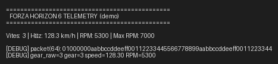

# TelemetryPulse

Repository: https://github.com/Furk4n3nes/TelemetryPulse

Bu proje, Forza Horizon 6 tarafından yayınlanan UDP telemetri paketlerini yakalayan, ayrıştıran ve terminalde temel telemetri bilgilerini gösteren küçük bir Python prototipidir. Aşağıda projenin amaçları, mimarisi, kullanılan teknolojiler, dosya yapısı, çalışma ve geliştirme rehberi ile dikkat edilmesi gereken noktalar ayrıntılı şekilde anlatılmaktadır.

## Özet

Proje, oyunun sağladığı ham binary paketlerini alıp (UDP), içindeki alanları çözerek (TelemetryReader), yapılandırılmış bir veri modeline (TelemetryData) dönüştürür. main.py gelen veriyi sürekli okur ve terminalde anlık verileri (vites, hız, RPM vb.) gösterir. Hedef, telemetri verisinin hızlıca gözlemlenebilmesi ve ileride daha gelişmiş gösterge panosu/telemetri kayıt sistemleri için temel oluşturmaktır.

## Neden yapıldı?

- Forza'daki gerçek zamanlı telemetri verisini görselleştirmek ve araç durumunu izlemek.
- Yarış geliştirme, analiz veya telemetri bazlı otomasyon (ör. telemetriye dayalı test) çalışmalarında hızlı prototip sağlamak.
- Öğrenme amaçlı: UDP üzerinden ikili paket işleme, Python struct okumaları ve basit veri stabilizasyonu örneği sunmak.

## Hangi teknolojiler/kararlar kullanıldı ve neden?

- Python 3: Hızlı geliştirme, geniş standart kütüphane (socket, struct) ve kolay test yazımı nedeniyle.
- socket (UDP): Forza telemetri tipik olarak UDP yayınlar; düşük gecikme gereksinimi için uygun.
- struct ile sabit endian/binary okuma (TelemetryReader): Paketler ikili formatta geldiği için kesin ve hızlı okuma gerekiyor.
- Basit terminal çıktısı: Hafif, bağımsız ve kolayca test edilebilir bir arayüz sağlıyor. İleri adımda GUI veya web dashboard eklenebilir.
- Birim testleri (tests/test_telemetry_parser.py): Parser doğruluğunu korumak ve refactor/iyileştirmelerde regresyonu önlemek için.

Bu teknolojiler tercih edildi çünkü proje prototip, hafif ve test edilebilir olmalıydı; ayrıca bağımlılık eklemeden çalışmalı.

## Mimari ve akış

1. UDPReceiver (udp_receiver.py) bir UDP soketi açar ve gelen paketleri döndürür.
2. TelemetryParser (telemetry/telemetry_parser.py) ham byte dizisini TelemetryReader yardımıyla alan alan okur ve TelemetryData nesnesi oluşturur.
3. main.py döngüsel olarak paketleri alır, parse eder ve terminalde gösterir. Görüntüleme tarafında basit bir stabilizasyon (debounce) uygulanır: vites değerinin ekranda ani atlamalar yapmaması için gear_raw ham baytı üç kez aynı gelene kadar göstermeyi sabitler.

Basit bir şema:

- UDP -> UDPReceiver.receive() -> TelemetryParser.parse() -> TelemetryData -> main.py gösterim

## Dosya açıklamaları

- [main.py](main.py): Uygulama giriş noktası. Döngü, gösterim ve debug seçenekleri burada.
- [udp_receiver.py](udp_receiver.py): UDP soket açma ve paket alma sınıfı UDPReceiver.
- [telemetry/telemetry_reader.py](telemetry/telemetry_reader.py): Binary buffer üzerinde typed okuma yardımcıları (int32, uint8, float, vb.).
- [telemetry/telemetry_data.py](telemetry/telemetry_data.py): TelemetryData dataclass — parse edilen alanların saklandığı yer. gear_raw ve gear gibi alanlar eklenmiştir.
- [telemetry/telemetry_parser.py](telemetry/telemetry_parser.py): Ham paketi okuyup TelemetryData oluşturan parser. Gear için ham byte okunup signed biçime çevriliyor.
- [tests/test_telemetry_parser.py](tests/test_telemetry_parser.py): Parser'ın vites okumasını doğrulayan birim testi.

## Paket formatı hakkında (mevcut varsayımlar)

Proje, Forza'ya ait tipik telemetri paketlerinden yola çıkarak bazı alanların sırayla geldiğini varsayar. Örneğin:

- Başlangıç: isRaceOn (int32), timestamp (uint32)
- Motor: engineMaxRPM, engineIdleRPM, currentRPM (float x3)
- Hız/ivme/veri: bir dizi float alan
- Sonunda gear tek bir bayt olarak geldiği kabul edildi — bu nedenle parser uint8 okuyor, ardından signed gear hesaplanıyor.

NOT: Eğer gerçek paket farklı bir yerde gear veriyorsa (farklı offset veya farklı boyutta), debug modu ile bu offset tespit edilip parser kolayca güncellenebilir.

## Demo Görüntüsü

Demo ekran görüntüsü: `demo.png` (üretmek için `tools/generate_demo_screenshot.py` kullanın). GitHub ana sayfasında görüntülemek için `demo.png` dosyasını pushlayın veya `demo_screenshot.txt`'yi inceleyin.



## Nasıl çalıştırılır

1. Python 3.8+ yüklü olduğundan emin olun.
2. Klasöre gidin ve main.py'yi çalıştırın:

```bash
python main.py
```

Debug modu (paketin hex, gear_raw, gear, speed, RPM gibi değerleri görmek için):

```bash
python main.py --debug
```

Debug tarama modu (paketlerde otomatik tarama/analiz eklediyseniz):

```bash
python main.py --debug-scan
```

## Testler

- Parser için örnek birim testi mevcuttur. Testleri çalıştırmak için:

```bash
python -m unittest
```

Testler parser değişiklikleri sonrası regresyonu yakalamaya yardımcı olur.

## Mevcut kısıtlar ve bilinen sorunlar

- Paket formatı tam doğrulanmadı; bazı alanlar parsede atlanmış veya yanlış offset'ten okunuyor olabilir.
- Vites gösterimi başlangıçta int32 olarak okunuyordu; bu nedenle terminalde garip büyük sayılar görünüyordu. Bu düzeltildi ve gear artık tek bayt olarak okunuyor ve signed olarak yorumlanıyor.
- Bazı durumlarda vites anlık hatalı okumalardan dolayı sıçrayabiliyordu — bu nedenle main.py içinde basit bir debounce/stabilizasyon eklendi.
- Daha sağlam bir çözüm için paket yapısı (tam alan listesi ve offset'ler) oyun içinden veya resmi dokümandan doğrulanmalıdır.

## Önerilen geliştirmeler (önceliklendirildi)

1. Paket formatının doğrulanması: Forza telemetri formatının resmi/daha geniş kaynaklardan doğrulanması ve tüm alanların kesin offset/uzunluk bilgilerinin elde edilmesi.
2. Tam parser: telemetry_parser içinde henüz okunmayan tüm alanların eklenmesi.
3. Loglama/kayıt: Ham paketlerin ve parse sonuçlarının dosyaya loglanması (rotasyonlu loglar).
4. Dashboard: Web (Flask/FastAPI + frontend) veya lokal GUI (Tkinter/PyQt) ile gösterge panosu.
5. Telemetri kaydı ve playback: Kayıt edilen telemetri üzerinden offline analiz ve görselleştirme.
6. Test genişletme: Farklı örnek paketler için daha fazla ünittest.

## Debug & sorunsuzlaştırma adımları

1. python main.py --debug ile çalıştırın, paket hex dump ve gear_raw değerlerini gözlemleyin.
2. Eğer araç hareket ederken (speed > 1) vites N ise, hex dump içindeki ileri offset'lerde (ör. diğer byte pozisyonları) tutarlı küçük tam sayı değerleri aranabilir — ben bu analizde yardımcı olabilirim.
3. Bulunan muhtemel offset test paketine eklenip parser güncellenir; birim testler çalıştırılarak doğrulama yapılır.

## Güvenlik ve gizlilik

- UDP telemetri, genellikle yerel ağda yayınlanan bilgi içerir. Bu veriler oyuncu davranışı, konum veya diğer hassas bilgileri içerebilir. Bu verileri paylaşmadan önce dikkatli olun.
- Programın internet erişimi yoktur; ancak eklenecek uzak log/telemetri servislerinde gizlilik politikaları değerlendirilmelidir.


